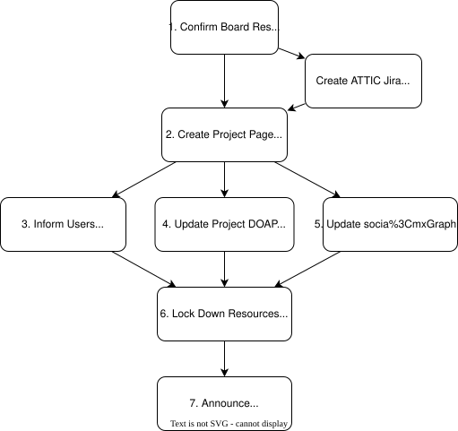

# Governance, Assets, and State

-   Every scenario relies on the same foundations:
    clear decision-making rules and an accurate inventory of assets
-   Put these in place while the project is healthy,
    because decisions under stress are harder and more error-prone than those made in advance
-   Use software-intensive projects for most examples because they're what the author is most familiar with
    -   Additions to cover other kinds of projects are very welcome

## Governance

-   Every team needs explicit decision-making rules
    -   Benevolent dictator for life (also known as  or "principal investigator")
    -   Or 
-   Rules must include : who can veto, not just who is consulted
-   Few projects have a `GOVERNANCE.md` file, and fewer still include shutdown criteria
-   The [Apache Software Foundation](@asf)'s [attic process](@asf-attic) is a documented model:
    -   At least three active respondents required for a viable project
    -   If they can't get a release out, shutdown process begins

<figure>
  
  <figcaption>Apache Attic Process</figcaption>
</figure>

-   In medicine, an  specifies
    what care a patient wants if they become unable to speak for themselves
-   Write one for the project while it is still healthy [@Towey2026]:
    -   Conditions for shutdown
    -   Who has authority to make the call
    -   What assets must be preserved
    -   What obligations must be honored
-   A closure plan that sits in a drawer and has never been tested
    is a  [@Clarke1999]
    -   Organizations routinely produce plans that reassure regulators and funders
        but bear no relationship to what would actually happen under stress
    -   A `HANDOVER.md` written by one person in an afternoon that no one else has read
    -   Ideally,
        walk through the closure plan periodically
        to check that each step is actually executable with the people available
    -   But the word "ideally" is doing a lot of work in that sentence

## Coupling and Cascading Failure

-   [@Singer2023]: organisations often invoke individual explanations
    to deflect systemic accountability
    -   "The driver wasn't paying attention" rather than "the dashboard was too complicated"
-   Project infrastructure is often 
    in ways that only become visible during shutdown [@Perrow1999]
    -   Failures in tightly-coupled systems are not aberrations
        but predictable outcomes of the system's design
-   E.g., an account that pays for ten services,
    or a single personal login that controls a domain,
    means that an unexpected departure can cascade into complete loss of access
-   Treat any single point of control that cannot survive 48-hour unavailability as a bug

## Assets

-   Knowing what you have is the first step to preserving it:
    code, data, discussion archives, credentials and access,
    the domain and web presence, metadata, and dependencies
-   "Preservation" means making work usable by someone who was not part of creating it
-   Capture the *why*, not just the *what*:
    a README explaining the problem solved is more durable than API documentation
-   Go through each asset type and ask two questions:
    -   How would someone else find and use this if we disappeared tomorrow?
    -   Under time pressure, what do we do first?
-   Treat every handover as an ,
    not an  [@Marks2022]
    -   An asset transfer moves selected assets and obligations;
        the original legal entity persists or is wound down separately
    -   An entity transfer moves the entire legal entity including unknown liabilities
    -   Being explicit about what is and is not transferred
        protects both the outgoing team and the incoming maintainers

## Specifics

Code
:   Archive to a persistent location such as Zenodo or Software Heritage
    and assign a  to the final release so it can be cited.
    Under time pressure, prioritize data over code:
    raw data is often irreplaceable,
    while code can be recovered or reconstructed

Data
:   Record provenance, format, units, and known limitations
    and follow  where possible.
    Under time pressure, copy the data out first.

Discussion archives
:   Mailing lists and issue trackers are often more valuable than formal documentation,
    so export and preserve them before paid services lapse [@Tamburri2020].
    Under time pressure, one public copy beats zero private ones:
    push the repository to a public location immediately, even in its current messy state.

Credentials and access
:   Hand them to a trusted person outside the project before access is cut.
    Do this before anything else in an emergency,
    because accounts stored in institutional systems will be unreachable
    once those systems are closed.

Domain and web presence
:   Domain names lapse and get squatted,
    so migrate content to free hosting before letting the domain go.

Metadata and identifiers
:   Mark deprecated versions in every relevant package registry,
    point to alternatives with a migration guide,
    and write a one-paragraph finder's note at the root of the archive.
    Under time pressure, export "everything else":
    issue tracker state, wiki pages, CI/CD configuration, deployment settings.

Dependencies
:   Dependencies rot, so record exact versions and, if possible,
    a container image that reproduces the computational environment

:::: {.callout-note}

Fifteen years ago,
a file-sharing system for scientific data based on the BitTorrent protocol
failed to find wide adoption because of the (quite reasonable) association in many institutions' collective minds
between BitTorrent and illegal downloading [@Langille2010].
At the time of writing,
though,
many individuals and groups are turning back to BitTorrent
to share datasets that are at risk of disappearing
because of the protocol's resilience.

::::

## Permissions

-   The  (also called "bus factor")
    -   What stops if someone wins the lottery and moves to Greenland with zero notice?
-   Use dedicated organizational accounts rather than personal ones
    -   But keep in mind that this introduces a risk because those accounts can disappear
    -   So add a personal account as a "backup"
-   Keep a findable list of privileged actions and the accounts that can perform them
-   Use a  for all organizational credentials
-   [Disaster Recovery](../disaster/index.qmd) covers the operational side of this
    -   The point here is to build the habit before you need it

## Legal and Administrative

-   Legal and administrative tasks are the most commonly skipped
    and the most likely to cause problems later
-   Most important thing is to *keep a record* of decisions made during shutdown:
    what was transferred, to whom, and when
    -   Use email rather than chat or video calls
        so that you have a record of everything said by both parties
    -   Your memory isn't perfect (particularly under difficult circumstances)
    -   And people may change their minds about what they said, meant, or promised
-   Determine who *legally* owns the project's outputs:
    individual contributors, an institution, or a formal entity
    -   IP policies differ between universities, companies, and grant-funded projects
    -   Check, don't assume
-   Institutions, journals, and funders have policies for licensing and sharing [@Katz2018]
    -   If you don't know if there is a policy or not, *ask someone*
    -   Look for an [Open Source Program Office](@ospo) (OSPO) or intellectual property (IP) office
-   Open source licenses are irrevocable,
    but closing repositories is still a meaningful decision for your community
-   Confidential and personally identifiable data has specific legal obligations
    for retention and deletion
-   Trademarks, domain names, and social media handles are assets with legal owners
    -   Transfer or release them explicitly
-   Financial accounts require formal closure
    -   Residual funds may need to be donated or returned
-   Grant reporting obligations survive project shutdown
    -   Check whether a final report is due
-   Build exit clauses into contracts and development agreements from the start, not when you need them

:::: {.callout-note}

There is often a difference in large bureaucratic organization
between the rules as written and the rules as enforced [@OSS1944].
If you are leaving your position on short notice or under difficult circumstances,
you may want to be selective about which forms you fill in proactively
and which you "just haven't gotten around to yet".
Members of marginalized groups have had more practice with these tactics
than members of privileged groups [@Scott1987];
if you belong to the latter,
a conversation or two with selected colleagues may help you see your priorities more clearly.

::::

## Normalized Deviations

-   The Challenger disaster resulted not from a single catastrophic decision
    but from a long sequence of small ones in which warning signals were repeatedly noticed,
    reinterpreted as acceptable,
    and filed away until deviation had become the norm [@Vaughan1996]
-   Teams approaching closure often carry the same kind of backlog
-   Deliberate closure should therefore include an explicit audit of
    :
    things the team accepted because stopping to fix them felt too costly
-   A shutdown retrospective is most valuable when it names the things the team learned to live with,
    not only when it celebrates successes
-   Document these to record the project's actual state
    and to avoid passing silent assumptions to anyone who inherits the work

## Exercises

### Project Inventory

1.  Make a list of everything that belongs to your project.
1.  Compare lists with others.
    What did they include that you missed and vice versa?
    What did someone include that other people think isn't actually part of the project?

The following may help you write your list:

-   Code, data, discussion archives, website, social media accounts,
    domain name, hardware, and…?
-   Hosting costs, software licenses, bank accounts, trademarks,
    partially-completed contracts, funding reports, confidential data obligations, and…?
-   Community goodwill, points of contact, and…?

### Who and What

1.  What would your project be unable to do if you were unavailable for three months?
1.  Which of your project's activities depend on personal accounts
    rather than accounts dedicated to the project?

### Normalized Deviations List

Write down three things in your project that everyone on the team knows are wrong
but that you have all learned to live with
(e.g., a dependency nobody wants to touch
or a process that only works because one person knows the trick).

-   Which items were hardest to decide about?
-   What did you want to hide, and why?
-   What would a successor most need to know?

### Project Advance Directive

1.  Write a one-page document covering:
    -   The conditions under which this project should be wound down
        (not just "when funding runs out" but specific observable signals)
    -   Who has the authority to make that call
        (distinguish between who must be consulted and who has an actual veto)
    -   What assets must be preserved before shutdown is complete, and how
    -   What obligations must be honoured before the project can be considered closed
1.  Give your document to a partner and ask them to find one realistic scenario
    it does not handle.
    What happens if the person with authority is unavailable?
    What happens if two people with veto disagree?

Which conditions were hardest to write precisely?
Where did "who is consulted" blur into "who has a veto"?
